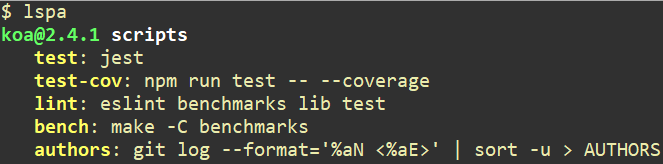

## What is "lspa"?

`lspa` is a node CLI for showing package.json scripts.

In the future, you can see more content about package.json.

## Installation

```sh
$ npm i lspa -g
```

## Usage

Anywhere in your Node project, you can use this CLI:
```sh
$ lspa
```

You will see something like this:


